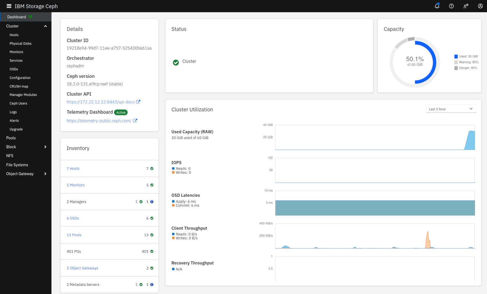

# Vagrant / Ansible IBM Storage Ceph Deployment

## Scope

This is an opinionated automated deployment of a IBM Storage Ceph 8.x cluster
installation based on RHEL9 up to the point where you run the preflight Ansible playbook.



## Acknowledgments

The code to facilitate automated subscription-manager registration was derived from the
[https://github.com/agarthetiger/vagrant-rhel8](https://github.com/agarthetiger/vagrant-rhel8)
project.

Copyright notice:

```text
# Copyright contributors to the rhcs5-vagrant project.
# Based on vagrant-rhel8 code - Copyright (c) 2019 Andrew Garner
```

## Prerequisites

You need a Linux host that is ideally equipped with 64GB+ RAM and 8+ vCPUs.
The configuration can be adjusted to make the deployment work on less capable
hardware.

Fedora Linux (IBM OpenClient for Fedora) was used to develop this automation.
Of course the instructions below can be adopted to other Linux variants with
their respective package manager commands.

- Vagrant: `sudo dnf -y install vagrant`
- QEM/KVM/libvirt: `sudo dnf -y install qemu libvirt libvirt-devel ruby-devel gcc`
- [Vagrant libvirt](https://github.com/vagrant-libvirt/vagrant-libvirt) Provider:
For Fedora use `sudo dnf -y install vagrant-libvirt`. Check for a package available
for your Linux distribution before trying to install with `vagrant plugin install vagrant-libvirt`.
- [Vagrant Hostmanager](https://github.com/devopsgroup-io/vagrant-hostmanager)
plugin: For Fedora use `sudo dnf -y install vagrant-hostmanager`.
Check for a package available for your Linux distribution before trying to install
with `vagrant plugin install vagrant-hostmanager`.
- Ansible: `sudo dnf -y install ansible`.

The host needs internet connectivity to download the required packages and
container images.

Tested with

- Fedora 36: Vagrant 2.2.19, vagrant-libvirt 0.7.0  and Ansible 5.9.0
- Fedora 37: Vagrant 2.2.19, vagrant-libvirt 0.7.0  and Ansible 7.1.0
- Fedora 38: Vagrant 2.2.19, vagrant-libvirt 0.7.0  and Ansible 7.7.0
- Fedora 39: Vagrant 2.3.4,  vagrant-libvirt 0.11.2 and Ansible 9.0.0
- Fedora 40: Vagrant 2.3.4,  vagrant-libvirt 0.11.2 and Ansible 9.11.0. On Fedora 40, it is highly recommended to manually apply [this patch](https://github.com/net-ssh/net-ssh/commit/efd0ebe882fce04952dcf1dbe2ba5618172f2172) to fix errors causing `vagrant halt` and `vagrant reload` to fail.
- Fedora 41: Vagrant 2.3.4, vagrant-libvirt 0.11.2 and Ansible 9.13.0.

You need a subscription for RHEL and a pull secret for IBM Storage Ceph.

Finally you need to create a private/public key pair in the `ceph-prep` directory:

```bash
cd ceph-prep
# use empty password when prompted
ssh-keygen -t rsa -f ./id_rsa
cd ..
```

There are some options that you can set in the [Vagrantfile](./Vagrantfile), look
at the section marked with `Some parameters that can be adjusted`.

## Installation

Bring up the Cluster by setting the environment variables with your Red Hat
credentials then start the vagrant/ansible driven deployment:

```bash
export RH_SUBSCRIPTION_MANAGER_USER='<your Red Hat username>'
export RH_SUBSCRIPTION_MANAGER_PW='<your Red Hat password>'
# For debugging: vagrant up --no-parallel --no-destroy-on-error
vagrant up --no-parallel
```

The vagrant deployment will automatically subscribe the machines at Red Hat.

To finalize the installation, ssh into the `ceph-admin` node and execute the
preflight Ansible playbook:

```bash
vagrant ssh ceph-admin
cd /usr/share/cephadm-ansible/
ansible-playbook -i inventory/production/hosts cephadm-preflight.yml --extra-vars "ceph_origin=ibm"
```

For the next step you need to set the environment variables again on the
ceph-admin node:

```bash
export IBM_CR_USERNAME='<your IBM Container Registry user name>'
export IBM_CR_PASSWORD='<your IBM Container Registry Entitlement key>'
```

Then you can continue with bootstrapping the cluster:

```bash
sudo cephadm bootstrap --cluster-network 172.21.12.0/24 --mon-ip 172.21.12.10 --registry-url cp.icr.io/cp --registry-username $IBM_CR_USERNAME  --registry-password $IBM_CR_PASSWORD
ssh-copy-id -f -i /etc/ceph/ceph.pub root@ceph-server-1
ssh-copy-id -f -i /etc/ceph/ceph.pub root@ceph-server-2
ssh-copy-id -f -i /etc/ceph/ceph.pub root@ceph-server-3
```

Note down the admin password that the `cephadm bootstrap` command printed. You
will need it for logging into the console the first time.

## Configuration

You can now complete the installation by logging into the
[IBM Storage Ceph GUI](https://172.21.12.10:8443) to

- change the password. You will be prompted automatically, the initial password
is the one you noted above as `cephadm bootstrap` output.
- activate telemetry module. See the warning on top of the screen after logging
in.
- add nodes using Cluster->Hosts->Add. Use ceph-server-1 with IP
172.21.12.12, ceph-server-2 with IP 172.21.12.13, ceph-server-3
with IP 172.21.12.14.
- add OSDs. Please wait until all ceph-server nodes are active, this might take
up to 10 minutes. When active, Cluster->Hosts shows mon service instances on
all nodes. Add OSDs via Cluster->OSDs->Create.

Most of the following is taken from the course [Hands-on with Red Hat Ceph Storage 5](https://training-lms.redhat.com/sso/saml/auth/rhopen?RelayState=deeplinkoffering%3D44428318)
with some improvements applied.

Note: When creating an RBD image, ensure that you do not have the `Exclusive Lock`
option set, otherwise there might be access issues mapping the RBD volume on the
client.

The following sections provide additional commands (on the `ceph-admin` node)
to configure RBD access, CephFS and RGW S3 and Swift access.

### Configure Block (RBD) access

```bash
vagrant ssh ceph-admin
# Create RBD pool
sudo ceph osd pool create rbd 64
sudo ceph osd pool application enable rbd rbd
# Create RBD user
sudo ceph auth get-or-create client.harald -o /etc/ceph/ceph.client.harald.keyring
sudo ceph auth caps client.harald mon 'allow r' osd 'allow rwx'
sudo ceph auth list
# Create RBD image
sudo rbd create rbd/test --size=128M
sudo rbd ls
```

### Configure File (CephFS) access

```bash
# Create CephFS
sudo ceph fs volume create fs_name --placement=ceph-server-1,ceph-server-2
sudo ceph fs volume ls
cd
cat <<EOF >mds.yaml 
service_type: mds
service_id: fs_name
placement:
  count: 2
EOF
sudo ceph orch apply -i mds.yaml
sudo ceph orch ls
sudo ceph orch ps
sudo ceph -s
sudo ceph df
sudo ceph fs status fs_name
# Authorize client file system access and grant quota and snapshot rights
sudo ceph fs authorize fs_name client.0 / rwps
sudo ceph auth get client.0 -o /etc/ceph/ceph.client.0.keyring
```

### Configure Object (RGW) access

```bash
# Create RGW

# Note that this is due to the low number of OSDs
# While we're setting it on global level to silence the warnings setting it
# on OSD and Mon level would have been sufficient. Setting it on Mon level as
# documented does not silence the warning.
sudo ceph config set global mon_max_pg_per_osd 512
sudo radosgw-admin realm create --rgw-realm=test_realm --default
sudo radosgw-admin zonegroup create --rgw-zonegroup=default --master --default
sudo radosgw-admin zone create --rgw-zonegroup=default --rgw-zone=test_zone --master --default
sudo radosgw-admin period update --rgw-realm=test_realm --commit
sudo ceph orch apply rgw test --realm=test_realm --zone=test_zone --placement="2 ceph-server-2 ceph-server-3"
sudo ceph orch ls
sudo ceph orch ps
sudo ceph -s
sudo radosgw-admin user create --uid='user1' --display-name='First User' --access-key='S3user1' --secret-key='S3user1key'
sudo radosgw-admin subuser create --uid='user1' --subuser='user1:swift' --secret-key='Swiftuser1key' --access=full
sudo radosgw-admin user info --uid='user1'
```

## Usage

Now use the created resources on the `ceph-client` node.

### RBD volume access

```bash
vagrant ssh ceph-client
# Add the configuration according to the admin node equivalent
sudo vi /etc/ceph/ceph.conf
# Add the client keyring according to the admin node equivalent
sudo vi /etc/ceph/ceph.client.harald.keyring
# Create a block device
sudo rbd --id harald ls
sudo rbd --id harald map rbd/test
sudo rbd --id harald showmapped
sudo mkfs.ext4 /dev/rbd0
sudo mkdir /mnt/rbd
sudo mount -o user /dev/rbd0 /mnt/rbd/
sudo chown vagrant:vagrant /mnt/rbd/
echo "hello world" > /mnt/rbd/hello.txt
```

### CephFS file access

```bash
# Add the 0 keyring file according to the admin node equivalent
sudo vi /etc/ceph/ceph.client.0.keyring
sudo mkdir /mnt/cephfs
sudo mount -t ceph ceph-server-1:6789:/ /mnt/cephfs -o name=0,fs=fs_name
sudo chown vagrant:vagrant /mnt/cephfs
df -h
echo "hello world" > /mnt/cephfs/hello.txt
```

### RGW OpenStack Swift object access

```bash
sudo dnf -y install python3-pip
pip3 install --user python-swiftclient
sudo rados --id harald lspools
swift -A http://ceph-server-2:80/auth/1.0 -U user1:swift -K 'Swiftuser1key' list
swift -A http://ceph-server-2:80/auth/1.0 -U user1:swift -K 'Swiftuser1key' post container-1
swift -A http://ceph-server-2:80/auth/1.0 -U user1:swift -K 'Swiftuser1key' list
base64 /dev/urandom | head -c 10000000 >dummy_file1.txt
swift -A http://ceph-server-2:80/auth/1.0 -U user1:swift -K 'Swiftuser1key' upload container-1 dummy_file1.txt 
```

### RGW S3 object access

Here we are actually testing S3 client access to the same data that was stored
using the Swift protocol.

```bash
curl -s https://awscli.amazonaws.com/awscli-exe-linux-x86_64.zip -o awscliv2.zip
sudo dnf -y install unzip
unzip awscliv2.zip 2>&1 >/dev/null
cd aws
sudo ./install
cd ..
rm -rf awscliv2.zip aws
aws configure set aws_access_key_id S3user1 --profile ceph
aws configure set aws_secret_access_key S3user1key --profile ceph
# Set region, otherwise bucket creation will fail
aws configure set region us-east-1 --profile ceph
# The following speeds up AWS CLI requests significantly
export AWS_EC2_METADATA_DISABLED=true
aws --profile ceph --endpoint http://ceph-server-2 s3 ls
aws --profile ceph --endpoint http://172.21.12.13 s3 ls s3://container-1
```

### Grafana Performance Dashboards

By default, the Grafana dashboards that as part of the Web UI "Overall Performance"
tabs will not show up.
To fix this, you need to

1. Add ceph-admin to `/etc/hosts` on your host: `172.21.12.10 ceph-admin`
2. Open a browser tab and point it to [https://ceph-admin:3000](https://ceph-admin:3000), then accept the self-signed certificate

Afterwards the Grafana dashboards should show up in the respective
"Overall Performance" tabs for Hosts, OSDs, Pools, Images, File Systems, and
Object Gateway Daemons.

### Reducing to 3 mons

After adding all nodes, a count of 5 mons is set while only four nodes are
available, thus only four mons will be running:

```bash
vagrant ssh ceph-admin
$ sudo ceph orch ls
NAME               PORTS        RUNNING  REFRESHED  AGE  PLACEMENT
...
mon                                 4/5  2m ago     5w   count:5
```

To get a better balanced state, reduce the number of mons to 3:

```bash
cat <<EOF>3-mons.yaml
service_type: mon
service_name: mon
placement:
  count: 3
EOF
sudo ceph orch apply -i 3-mons.yaml
```

This will result in:

```bash
$ sudo ceph orch ls
NAME               PORTS        RUNNING  REFRESHED  AGE  PLACEMENT
...
mon                                 3/3  65s ago    6s   count:3
...
```

## Shutting down and restarting the VMs

Shutting down the VMs with `vagrant halt` then re-starting them at a later time
with `vagrant reload` works with this solution.

RBD mappings/mounts and CephFS mounts on the ceph-client VM need to be
re-created after re-starting.

## Deleting the deployment

Ensure that you have the machines up and running when destroying the machines
using `vagrant destroy -f` because only then the machines will be automatically
unregistered at Red Hat.

## Contacting the Project Maintainers, Contributing

**NOTE: This repository has been configured with the [DCO bot](https://github.com/probot/dco).**

If you have any questions or issues you can create a new [issue here](https://github.com/IBM/rhcs5-vagrant/issues).

Pull requests are very welcome! Make sure your patches are well tested.
Ideally create a topic branch for every separate change you make. For
example:

1. Fork the repo
2. Create your feature branch (`git checkout -b my-new-feature`)
3. Commit your changes (`git commit -am 'Added some feature'`)
4. Push to the branch (`git push origin my-new-feature`)
5. Create new Pull Request

## License

All source files must include a Copyright and License header. The SPDX license header is
preferred because it can be easily scanned.

If you would like to see the detailed LICENSE click [here](LICENSE).

```text
#
# Copyright 2022- IBM Inc. All rights reserved
# SPDX-License-Identifier: MIT
#
```
